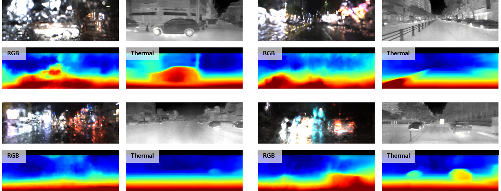

# Deep Depth Estimation from Thermal Images: Dataset, Bechmark, and Analysis

This is the official pytorch implementation of the paper:

 >Deep Depth Estimation from Thermal Images: Dataset, Bechmark, and Analysis
 >
 >[Ukcheol Shin](https://ukcheolshin.github.io/), Jinsun Park
 >
 >[[Paper]()] [[Dataset](https://sites.google.com/view/multi-spectral-stereo-dataset/home)]


### Depth Estimation Results on MS2 dataset
#### Depth estimatoin from RGB vs thermal images in heavy rainy conditions



### Updates
- 2025.01.29: Release source code & pre-trained weights.

## Usage
### 0. Installation
This codebase was developed and tested with the following packages. 
- OS: Ubuntu 20.04.1 LTS
- CUDA: 11.3
- PyTorch: 1.9.1
- Python: 3.9.16

You can build your conda environment with the following commands.
```bash
conda create python=3.9 pytorch=1.9.1 cudatoolkit=11.1 -c pytorch -c conda-forge --name MS2_bench
conda activate MS2_bench
conda install core iopath pytorch3d -c pytorch -c conda-forge -c pytorch3d -y
pip install mmcv pytorch_lightning timm setuptools==59.5.0 matplotlib imageio path
```

After building conda environment, compile CUDA kernel for the deformable conv layer of AANet.
If you have trouble, refer [here](https://github.com/haofeixu/aanet)
```
cd models/network/aanet/deform_conv/
sh build.sh
```

### 1. Dataset
You can download MS2 dataset [here](https://sites.google.com/view/multi-spectral-stereo-dataset/home).
For the train/val/test list for MS2 dataset, copy the txt files from "[MS2dataset Github](https://github.com/UkcheolShin/MS2-MultiSpectralStereoDataset)"
After downloading the dataset, locate the dataset as follows:
```shell
<datasets>
|-- <KAIST_MS2>
    |-- <sync_data>
    |-- <proj_depth>
    |-- ...
    |-- train_list.txt
    |-- val_list.txt
    |-- ...
```


### Training
1. Download each model's pre-trained or backbone model weights if you need. 
For the NeWCRF model training, please download pre-trained Swin-V1 weights [here](https://github.com/microsoft/Swin-Transformer?tab=readme-ov-file). 

After downloading the weights, locate them "pt_weights" folder as follows:
```bash
<pt_weights>
|-- <swin_tiny_patch4_window7_224_22k.pth>
|-- ...
|-- <swin_large_patch4_window7_224_22k.pth>
```

2. Train a model with the config file.
If you want to change hyperparamter (e.g., batch size, epoch, learning rate, etc), edit config file in 'configs' folder.

> Single GPU, MS2 dataset, MonoStereoCRF model
```bash
CUDA_VISIBLE_DEVICES=0 python train.py --config ./configs/StereoSupDepth/MSCRF.yaml --num_gpus 1 --exp_name MSCRF_MS2_singleGPU
```

> Multi GPUs, MS2 dataset, other models
```bash
# Mono depth estimation model
CUDA_VISIBLE_DEVICES=0,1 python train.py --config ./configs/MonoSupDepth/<target_model>.yaml --num_gpus 2 --exp_name <Model>_MS2_multiGPU

# Stereo matching model
CUDA_VISIBLE_DEVICES=0,1 python train.py --config ./configs/StereoSupDepth/<target_model>.yaml --num_gpus 2 --exp_name <Model>_MS2_multiGPU
```

3. Start a `tensorboard` session to check training progress. 
```bash
tensorboard --logdir=checkpoints/ --bind_all
```
You can see the progress by opening [https://localhost:6006](https://localhost:6006) on your browser. 

### Evaluation

Evaluate the trained model by running
```bash
# MS2-day evaluation set / Monocular depth estimation
CUDA_VISIBLE_DEVICES=0 python test_monodepth.py --config ./configs/MonoSupDepth/<target_model>.yaml --ckpt_path "PATH for WEIGHT" --test_env test_day  --save_dir ./results/<target_model>/thr_day --modality thr

# MS2-night evaluation set / Monocular depth estimation
CUDA_VISIBLE_DEVICES=0 python test_monodepth.py --config ./configs/MonoSupDepth/<target_model>.yaml --ckpt_path "PATH for WEIGHT" --test_env test_night  --save_dir ./results/<target_model>/thr_day --modality thr

# MS2-rainy_day evaluation set / Monocular depth estimation
CUDA_VISIBLE_DEVICES=0 python test_monodepth.py --config ./configs/MonoSupDepth/<target_model>.yaml --ckpt_path "PATH for WEIGHT" --test_env test_rain  --save_dir ./results/<target_model>/thr_day --modality thr

# MS2-day evaluation set / Stereo matching
CUDA_VISIBLE_DEVICES=0 python test_disparity.py --config ./configs/StereoSupDepth/<target_model>.yaml --ckpt_path "PATH for WEIGHT" --test_env test_day  --save_dir ./results/<target_model>/thr_day --modality thr

# MS2-day evaluation set / Stereo matching / MS_CRF model for Monocular depth estimation mode
CUDA_VISIBLE_DEVICES=0 python test_disparity.py --config ./configs/StereoSupDepth/MSCRF.yaml --ckpt_path "PATH for WEIGHT" --test_env test_day  --save_dir ./results/MSCRF_mono/thr_day --mono_mode --modality thr

# Timing & FLOP evaluation for monocular depth estimation network
CUDA_VISIBLE_DEVICES=0 python test_timingNflop.py --config configs/MonoSupDepth/<target_model>.yaml 

# Timing & FLOP evaluation for stereo matching network
CUDA_VISIBLE_DEVICES=0 python test_timingNflop.py --config configs/StereoSupDepth/<target_model>.yaml --is_stereo
```

### Demo

Inference demo images by running
```bash
# Download the pre-trained weights
bash ./checkpoints/download_pretrained_weights.sh

# Monocular depth estimation (RGB)
CUDA_VISIBLE_DEVICES=0 python inference_depth.py --config ./configs/MonoSupDepth/<target_model>.yaml --ckpt_path "PATH for WEIGHT" --save_dir ./demo_results/mono/ --modality rgb
# Monocular depth estimation (THR)
CUDA_VISIBLE_DEVICES=0 python inference_depth.py --config ./configs/MonoSupDepth/<target_model>.yaml --ckpt_path "PATH for WEIGHT" --save_dir ./demo_results/mono/ --modality thr

# Stereo matching (RGB)
CUDA_VISIBLE_DEVICES=0 python inference_disp.py --config ./configs/StereoSupDepth/<target_model>.yaml --ckpt_path "PATH for WEIGHT" --save_dir ./demo_results/stereo/ --modality rgb
# Stereo matching (THR)
CUDA_VISIBLE_DEVICES=0 python inference_disp.py --config ./configs/StereoSupDepth/<target_model>.yaml --ckpt_path "PATH for WEIGHT" --save_dir ./demo_results/stereo/ --modality thr
```

## Result
We offer the pre-trained model weights that reported on [the extended paper]().
Differing to CVPR paper, the models are trained and evaluated with the "filtered" depth/disparity GT labels.

To reproduce the reported results, follows the below instructions.
```bash
# Download the pre-trained weights
bash ./checkpoints/download_pretrained_weights.sh

# Run benchmark for monocular depth networks and stereo matching networks
bash ./scripts/run_benchmark_monodepth.sh && bash ./scripts/run_benchmark_stereomatching.sh
```

### Monocular Depth Estimation Results
The results are averaged over MS^2 evaluation sets (test_day, test_night, test_rain).

Please refer to [the extended paper]() for more detailed results. 

|   Models   | TestSet | Abs Rel | Sq Rel | RMSE  | RMSE(log) | Acc.1 | Acc.2 | Acc.3 | Weight|
|:---:|:---:|:---:|:---:|:---:|:---:|:---:|:---:|:---:|:---:|
|DORN|RGB|0.130|0.908|4.840|0.175|0.840|0.970|0.992|[RGB](https://www.dropbox.com/scl/fi/ssh2pb95puanrj230i386/MS2_MD_DORN_RGB_ckpt.ckpt?rlkey=29gt7i563wlr50y2ess6x4kqe&st=c9c5mkoi&dl=1)|
|DORN|NIR|0.139|0.917|4.471|0.177|0.825|0.967|0.991|[NIR](https://www.dropbox.com/scl/fi/wy94xjloxjo821gzyzhnu/MS2_MD_DORN_NIR_ckpt.ckpt?rlkey=i7wus22uvqka7ky70a6yvf3f3&st=4v00zct7&dl=1)|
|DORN|THR|0.109|0.540|3.660|0.144|0.887|0.982|0.996|[THR](https://www.dropbox.com/scl/fi/b8m0iwk988l6lwcwi5m0o/MS2_MD_DORN_THR_ckpt.ckpt?rlkey=j0sfm0xmpmokdlkgb7cqzhb08&st=aeego6v0&dl=1)|
|BTS|RGB|0.107|0.635|4.128|0.147|0.883|0.980|0.995|[RGB](https://www.dropbox.com/scl/fi/dm19tpr22td05mibqvv0j/MS2_MD_BTS_RGB_ckpt.ckpt?rlkey=5u6ejjqboj8kri2o7x7ej1ari&st=blhwffbh&dl=1)|
|BTS|NIR|0.123|0.784|4.159|0.158|0.862|0.972|0.992|[NIR](https://www.dropbox.com/scl/fi/etmoypbdmd3sf4wcsefhe/MS2_MD_BTS_NIR_ckpt.ckpt?rlkey=hmq9iw1ojrx2e0sgrnpj0gjja&st=bzh3xgyv&dl=1)|
|BTS|THR|0.086|0.380|3.163|0.117|0.927|0.990|0.998|[THR](https://www.dropbox.com/scl/fi/gqko0ownuccirzy1mg1ug/MS2_MD_BTS_THR_ckpt.ckpt?rlkey=kn9v8mceycpydd6i8fgy2k0u8&st=bc1qbquf&dl=1)|
|Adabin|RGB|0.112|0.650|4.197|0.150|0.877|0.979|0.995|[RGB](https://www.dropbox.com/scl/fi/exjo1vq8ygzfut733tvmi/MS2_MD_AdaBins_RGB_ckpt.ckpt?rlkey=1m0qq7tqyieurfsrpmdganw8q&st=jcxumgw6&dl=1)|
|Adabin|NIR|0.121|0.740|4.059|0.154|0.865|0.974|0.993|[NIR](https://www.dropbox.com/scl/fi/1r78opyyj1q8u4w5xq79m/MS2_MD_AdaBins_NIR_ckpt.ckpt?rlkey=ta9051eqi4x0o2b0ozftpywsp&st=904iricc&dl=1)|
|Adabin|THR|0.088|0.377|3.152|0.119|0.924|0.990|0.998|[THR](https://www.dropbox.com/scl/fi/2ar82el6mdm4myumzy175/MS2_MD_AdaBins_THR_ckpt.ckpt?rlkey=zt1i4vapcbq6xpeu1659grjbi&st=pizidekp&dl=1)|
|NewCRF|RGB|0.099|0.520|3.729|0.133|0.905|0.987|0.997|[RGB](https://www.dropbox.com/scl/fi/b332awotceos6jxb25w38/MS2_MD_NeWCRF_RGB_ckpt.ckpt?rlkey=8hpgg8g1ex3m1208y73kj5ltp&st=firpnxua&dl=1)|
|NewCRF|NIR|0.112|0.641|3.791|0.144|0.883|0.979|0.994|[NIR](https://www.dropbox.com/scl/fi/e48k5azsb08lp65lpcagl/MS2_MD_NeWCRF_NIR_ckpt.ckpt?rlkey=vg7kjhmfpw564sbyjsbgr51eu&st=3vd3dmbe&dl=1)|
|NewCRF|THR|0.081|0.331|2.937|0.109|0.937|0.992|0.999|[THR](https://www.dropbox.com/scl/fi/mn9jm68p08kdwl89hls82/MS2_MD_NeWCRF_THR_ckpt.ckpt?rlkey=g3kzyc2f4y3t9q7blrmc2j2h0&st=t8p6mcu8&dl=1)|

### Stereo Matching Results
|   Models   | TestSet | EPE-all(px) | D1-all(%) | >1px(%)  | >2px(%) | Weight|
|:---:|:---:|:---:|:---:|:---:|:---:|:---:|
|PSMNet|RGB|0.400|0.981|7.856|2.177|[RGB](https://www.dropbox.com/scl/fi/ir342h44t1tvw36qmul8a/MS2_SM_PSMNet_RGB_ckpt.ckpt?rlkey=w578ciw1wzc72i1yriusiu4dg&st=3votfzs3&dl=1)|
|PSMNet|THR|0.292|0.257|3.794|0.737|[THR](https://www.dropbox.com/scl/fi/vsrqwe9guzeenviwueu2u/MS2_SM_PSMNet_THR_ckpt.ckpt?rlkey=lha975k05b5bmg2bhp7hc3ez8&st=9a3g8cym&dl=1)|
|GWCNet|RGB|0.401|1.080|8.062|2.442|[RGB](https://www.dropbox.com/scl/fi/3xdvul8peuk4vmpthzxnu/MS2_SM_GWCNet_RGB_ckpt.ckpt?rlkey=43vpzr6xfyyixddbl4ms5af02&st=zwqlk8mz&dl=1)|
|GWCNet|THR|0.285|0.223|3.565|0.685|[THR](https://www.dropbox.com/scl/fi/q94yfl3l0g76ygm7ieaug/MS2_SM_GWCNet_THR_ckpt.ckpt?rlkey=zpqm52b7zz1gpwc32y4wz4gc5&st=58vv7fxz&dl=1)|
|AANet|RGB|0.399|1.131|8.227|2.543|[RGB](https://www.dropbox.com/scl/fi/t8x84ke3glfnk9m07xqak/MS2_SM_AANet_RGB_ckpt.ckpt?rlkey=zo2dphp58f4egbzcsvwjt94rm&st=imy2xf3c&dl=1)|
|AANet|THR|0.284|0.305|3.780|0.811|[THR](https://www.dropbox.com/scl/fi/tdxyzvpw9wlc3dbp0a1dn/MS2_SM_AANet_THR_ckpt.ckpt?rlkey=j365ti4fcyh09peifme5vbedd&st=n3iywazw&dl=1)|
|ACVNet|RGB|0.393|1.024|7.772|2.353|[RGB](https://www.dropbox.com/scl/fi/99ql7wj6k3j8rploittyc/MS2_SM_ACVNet_RGB_ckpt.ckpt?rlkey=lrkjrvutaf79d8bwyrtpub6zm&st=ujtxvseu&dl=1)|
|ACVNet|THR|0.279|0.252|3.567|0.709|[THR](https://www.dropbox.com/scl/fi/rvrhwe486u03ls241foe5/MS2_SM_ACVNet_THR_ckpt.ckpt?rlkey=jniq0nbrblin72dqpjszc3wxz&st=uqhia4q5&dl=1)|

## License
Shield: [](https://opensource.org/licenses/MIT)

Our code is licensed under a [MIT License](LICENSE).

## Citation

Please cite the following paper if you use our work in your research.

```
	@inproceedings{shin2023deep,
	  title={Deep Depth Estimation From Thermal Image},
	  author={Shin, Ukcheol and Park, Jinsun and Kweon, In So},
	  booktitle={Proceedings of the IEEE/CVF Conference on Computer Vision and Pattern Recognition},
	  pages={1043--1053},
	  year={2023}
	}

	@inproceedings{shin2025deep,
	  title={Deep Depth Estimation From Thermal Image: Dataset, Benchmark, and Analysis},
	  author={Shin, Ukcheol and Park, Jinsun},
	  TBA
	}
```

## Related projects & Acknowledgement
Each network architecture built upon the following codebases. 
* [DORN](https://github.com/liviniuk/DORN_depth_estimation_Pytorch)
* [BTS](https://github.com/cleinc/bts)
* [MiDaS](https://github.com/isl-org/MiDaS)
* [AdaBins](https://github.com/shariqfarooq123/AdaBins)
* [NeWCRF](https://github.com/aliyun/NeWCRFs)
* [PSMNet](https://github.com/JiaRenChang/PSMNet)
* [GWCNet](https://github.com/xy-guo/GwcNet)
* [CFNet](https://github.com/gallenszl/CFNet)
* [AANet](https://github.com/haofeixu/aanet)
* [ACVNet](https://github.com/gangweiX/ACVNet)